# Zann

Self-hosted password manager for individuals and small teams.

> **⚠️ Pet Project Notice**
>
> This project:
> - Is a pet project for experiments
> - Has a codebase written with LLM assistance
> - **Has not passed a security audit**
> - **Is not recommended for production**
>
> Use at your own risk for testing and learning.

## Features

- **🔐 Client-side encryption** — personal vaults are encrypted on the client
- **👥 Shared vaults** — shared vaults for small teams
- **🤖 CI/CD CLI** — service account tokens, server fingerprint pinning
- **💻 Desktop app** — offline-first, works without a server (macOS, Windows)
- **🔑 Hybrid auth** — OIDC + built-in authentication

## Screenshots


## Quick start

### Option 1: Local use (no server)

1. Download the desktop app for your platform from [Releases](https://github.com/constXife/zann/releases)
2. Launch the app — it works offline-first
3. Create a personal vault and start using it

### Option 2: Self-hosted server (for small teams and CI/CD)

```bash
# Clone the repo
git clone https://github.com/constXife/zann
cd zann

# Start the server via Docker Compose
docker compose up -d

# The server is available at http://localhost:8080
```

## Architecture

```mermaid
graph TD
    Desktop["💻 Desktop App<br/>(Tauri/SQLite)<br/>Offline-first"]
    CLI["⌨️ CLI Client<br/>(Rust)<br/>CI/CD ready"]
    Server["🔐 Zann Server<br/>(Axum + PostgreSQL)"]

    Desktop -->|REST API| Server
    CLI -->|REST API| Server

    style Desktop fill:#e1f5ff
    style CLI fill:#e1f5ff
    style Server fill:#ffe1e1
```



Components:
- `zann-server` — HTTP API (Axum, PostgreSQL)
- `zann-cli` — CLI client for Linux/macOS/CI
- `apps/desktop` — Desktop app (Tauri, SQLite)
- `zann-core` — shared business logic and cryptography

Server threat model: [crates/zann-server/SECURITY.md](crates/zann-server/SECURITY.md) (assumptions and trust boundaries).

## For DevOps and CI/CD

Zann supports CI/CD integrations:

- **Service account tokens** for automation
- **Prefix-based access control** to limit access
- **Server fingerprint pinning** to prevent MITM attacks
- **CLI commands** like `zann get my-secret` for scripts

GitHub Actions example:

```yaml
- name: Get database password
  run: |
    export DB_PASSWORD=$(zann get prod/db/password)
    ./deploy.sh
  env:
    ZANN_TOKEN: ${{ secrets.ZANN_SERVICE_TOKEN }}
```

## Performance baseline

From a local k6 "morning sync" run (~500 VUs, ~2.5k req/s):
- **RSS memory**: ~100 MiB
- **Errors**: no 5xx observed

CPU usage depends on workload and database performance. See [loadtest/k6/scenarios/morning_sync.js](loadtest/k6/scenarios/morning_sync.js) for the scenario.

## Tech stack

**Backend**: Rust, Axum, PostgreSQL, SQLx, Argon2id, ChaCha20Poly1305
**Desktop**: Tauri, Vue 3, TypeScript, TailwindCSS
**DevOps**: Docker Compose, GitHub Actions, Prometheus, OpenTelemetry

## Development

See [CONTRIBUTING.md](CONTRIBUTING.md) for local development instructions.

## License

MIT License — see [LICENSE](LICENSE)

Copyright 2025 constXife
