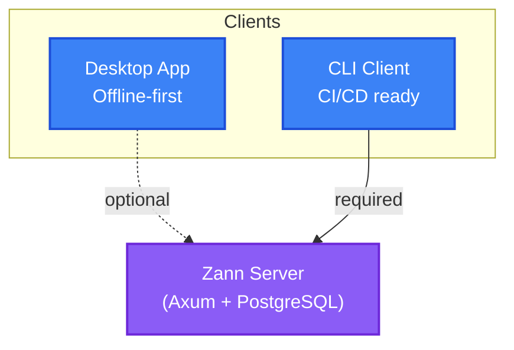

<!-- Generated from README.md. Do not edit this file directly. -->

Self-hosted password manager for individuals and small teams.

> **Pet Project Notice**
>
> This project:
> - Is a pet project for experiments
> - Has a codebase written with LLM assistance
> - **Has not passed a security audit**
> - **Is not recommended for production**
>
> Use at your own risk for testing and learning.

## Features

- **Client-side encryption** - personal vaults are encrypted on the client
- **Shared vaults** - shared vaults for small teams
- **CI/CD CLI** - service account tokens, server fingerprint pinning
- **Desktop app** - offline-first, works without a server (macOS, Windows)
- **Hybrid auth** - OIDC + built-in authentication

## Stability

**Current status:** experimental. Until **v0.Y** (refactor milestone), the API,
CLI, and config format may change without backward compatibility.

### Policy starts at v0.Y

After the refactor milestone, we will publish a stability policy and follow it
for:
- API compatibility
- Config format migrations
- Client/server version support windows

### Breaking changes (pre-policy phase)

- May happen without migration steps
- Will still be noted in [CHANGELOG](CHANGELOG.md) when possible

## Screenshots


## Quick start

### Option 1: Local use (no server)

1. Download the desktop app for your platform from [Releases](https://github.com/constXife/zann/releases)
2. Launch the app - it works offline-first
3. Create a personal vault and start using it

If your platform is not listed in Releases, build the desktop app from source
(requires Rust toolchain, Bun, and Tauri system dependencies):

```bash
cd apps/desktop
bun install
bun run tauri build
```

See `CONTRIBUTING.md` for platform-specific Tauri prerequisites.

Full install guide: `/install/`.

### Option 2: Self-hosted server (for small teams and CI/CD)

```bash
# Clone the repo
git clone https://github.com/constXife/zann
cd zann

# Start the server via Docker Compose
docker compose up -d

# The server is available at http://localhost:8080
```

## Architecture



Components:
- `zann-server` - HTTP API (Axum, PostgreSQL)
- `zann-cli` - CLI client for Linux/macOS/CI
- `apps/desktop` - Desktop app (Tauri, SQLite)
- `zann-core` - shared business logic and cryptography

Server threat model: [crates/zann-server/SECURITY.md](crates/zann-server/SECURITY.md) (assumptions and trust boundaries).

## Usage overview

### General

- Desktop is the primary client for people (personal vaults + shared vaults).
- CLI is for automation and CI/CD; it is token-based and requires the server.
- Server provides the API, shared vaults, and token issuance.

### Desktop

- Offline-first for personal vaults; optional server connection for shared vaults.
- Recommended for interactive use and day-to-day management.

### CLI (token-based)

- Uses tokens issued by the server (service account tokens).
- Provide tokens via `--token`, `--token-file`, or `zann config set-context`.
- Print version info with `zann version`.

Example token creation and CLI setup:

```bash
# Create a service account token on the server
zann-server token create ci-prod infra:/

# Configure the CLI in your CI job
zann config set-context ci \
  --addr https://zann.example.com \
  --token "$ZANN_SERVICE_TOKEN" \
  --vault infra
```

### Server

- Runs as the shared backend (Docker Compose or prebuilt image).
- Issues tokens and enforces access scope and IP restrictions.

## For DevOps and CI/CD

Zann supports CI/CD integrations:

- **Service account tokens** for automation
- **Prefix-based access control** to limit access
- **Server fingerprint pinning** to prevent MITM attacks
- **CLI commands** like `zann get my-secret` for scripts

Service token + CLI example:

```bash
# 1) Create a service account token on the server
zann-server token create ci-prod infra:/
# Save the "token" output in your CI secret store as ZANN_SERVICE_TOKEN

# 2) Configure the CLI in your CI job
zann config set-context ci \
  --addr https://zann.example.com \
  --token "$ZANN_SERVICE_TOKEN" \
  --vault infra

# 3) Fetch a secret
export DB_PASSWORD="$(zann get infra/db/creds password)"
```

## Performance baseline

From a local k6 "morning sync" run (~500 VUs, ~2.5k req/s):
- **RSS memory**: ~100 MiB
- **Errors**: no 5xx observed

CPU usage depends on workload and database performance. See [loadtest/k6/scenarios/morning_sync.js](loadtest/k6/scenarios/morning_sync.js) for the scenario.

## Tech stack

**Backend**: Rust, Axum, PostgreSQL, SQLx, Argon2id, ChaCha20Poly1305
**Desktop**: Tauri, Vue 3, TypeScript, TailwindCSS
**DevOps**: Docker Compose, GitHub Actions, Prometheus, OpenTelemetry

## Development

See [CONTRIBUTING.md](CONTRIBUTING.md) for local development instructions.

## License

MIT License - see [LICENSE](LICENSE)

Copyright 2025 constXife
